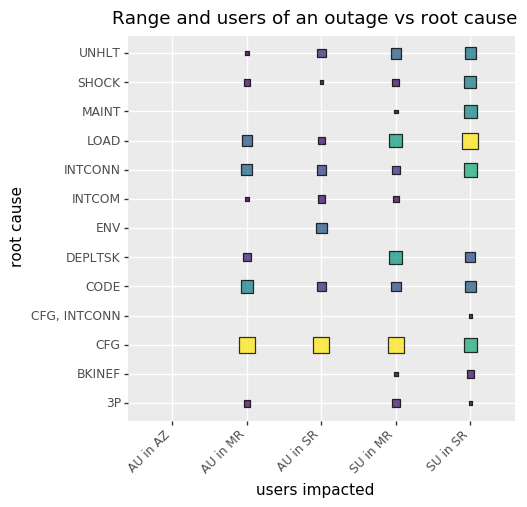

The plot above shows the duration and severity of outages, as well as the users affected by the outages, by vendor.
The horizontal axis lists the vendors for which we have data, and the vertical axis shows the various combinations of severities, durations, and affected users.
The size and color of a point indicates the number of outages at that point.
The findings show that the most common outage is where a service, or a part of a service, becomes intermittently unavailable.
This is for example when a certain percentage of API requests fails, or when it is intermittently not possible to connect to an instance.
For most AWS and GCP outages, this affects all of the users in the range of the outage (i.e. one region, multiple regions, or a single availability zone).
For Azure services, the impact is more limited, affecting only some users in the range of the outage.
The second most common outages for AWS affect all users: either the service is continuously degraded (i.e. experiencing latency), or it is intermittently degraded and unavailable (i.e. experiencing intermittent errors and latencies).
Azure issues that result in a service being intermittently degraded and unavailable generally seem to impact a smaller range of customers.
For GCP, this category of outages is not prominent; it is instead more common for services to be continuously unavailable for all users in the range of the outage.

The results in Figure 2 above show the causes of outages with varying areas of effect.
The causes are listed on the vertical axis, and the horizontal axis contains the combinations of users affected (some or all) and the impacted area (in ascending size: single availability zone, single region, multiple regions).
The color and size of a point indicates the number of outages at that point.
It is important to note that this plot does not include all of the outages, as 65.12% of the outages did not report a root cause (especially those reported by AWS), eight did not report a range, and seven did not report whether some or all users were affected.
Furthermore, the 'single availability zone' range is an AWS-only concept, which is why there is only one data point in this category.

The first observation is that it is most common for outages to affect some users in multiple regions.
That is, the impact of the outages is not restricted geographically, but by some other factor.
The leading cause of these outages is a configuration error; in fact, a configuration error is the root cause of the majority of outages.

The second main cause of the outages with the largest impact, those affecting all users in multiple regions, is a code error.
Interestingly, code errors do not account for as many outages in the other categories.
The second main causes of outages affecting some users in multiple regions are deployment tasks and increased load on the service.
An increased load only accounts for the majority of outages in the case of outages that affect some users in a single region.
In summary, the data shows that most outages (especially the more severe multi-region outages) are caused by human error, rather than unfavourable conditions or other factors outside of the vendors' control.
